- 👋 Hello there, I’m Minhazul Haque Ashim, people address me as Minhaz / Ashim. I am a full time developer and part time problem solver.
- 👀 I’m interested and working with Web Application Development.
- 🌱 My current stack is MERN stack as my primary stack, I am also looking forward to contribute in projects with Python, C#, C++ and Golang development.
- 💞️ I’m looking to collaborate on Web App Development
- 📫 You can reach me at my email address which is "minhazul.ashim@gmail.com". I am attaching other social media information as well.

<h3>Connect with me here!!!</h3>

  

    
  

  

    
  

  

    
  

    

